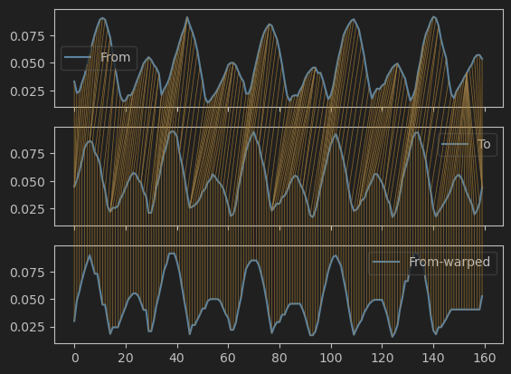
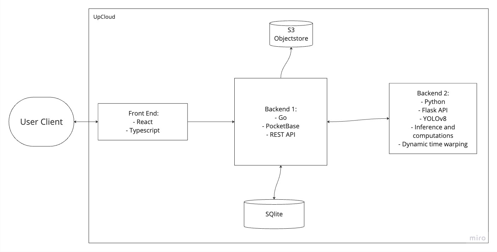

# Weihua - Learn the moves

### [Junction'23](https://www.junction2023.com/), Huawei challenge

## Context

More and more concerns are being voiced about mental health situation, especially among young ([1]). The Covid-19 pandemic made us
more isolated and less physically active. What's more, rise of addictive social media apps that use techniques like eroding natural cues
and the slot machine effect ([2]) further promotes harmful sedentary lifestyle. However, aerobic exercises of low to moderate
intensity are proven to have a positive effect on wellbeing ([3]).

## Concept

Weihua is social media of the new age. 
Combining many features of the apps young people enjoy, it is created with wellbeing of its users at the core. 
Physical activity brings users to our app, not the toxic social media mechanisms. 

Weihua is a fun way to challenge yourself and your friends, while learning some moves to show off at a party later, 
together with your friend group. Every day there are 5 new challenges of different difficulty, which you can try to complete.
You will see how well you managed to reproduce the dance, and compete against your friends and people in your country 
(within your difficulty level). No users are able to see others' videos, only scores. 

Key features include

- watching the dance challenge and recording your own attempt in the app
- scoring of how well your dance matches the dance in today's challenge
- leaderboard within your friend group for the current day 

The app builds on success of popular apps like BeReal and TikTok to encourage people to move, in a fun and engaging way.
We hope that by trying again and again to reproduce a challenging dance our users will receive the necessary minutes of 
daily physical activity.

[//]: # (not yet true - We take concerns about social media seriously and design our app in a way that avoids body-shaming, discrimination, hate speech.)

## Implementation

**_Note: our app is optimized for mobile devices!_**

We used state-of-the-art computer vision models to extract pose data from video data.
With this we can compare user submissions to a reference choreography, and give user scores depending on how accurately they follow the original moves.

We used the _YOLOv8n-pose_ model to extract pose data efficiently on the server after streaming webcam footage from the client. The pose data is compared using _dynamic time warping_, which can alleviate syncing issues between the submission and reference.

### YOLO

YOLO stands for You Only Look Once, and works by being incredibly efficient on single images, which means this can be done repeatedly for every image in a videostream.
Ready-trained models can be downloaded online, and are easy to get up and running with.

### Dynamic time warping

With time-series analysis, one of the most challenging aspects is the synchronisation of the two different clips. The choreography is with high probability shifted in time in some way, which makes frame-to-frame distances infeasible without further work.
Dynamic time warping works by matching up peaks and throughs, and allows for some shifts in time between the datasets.
DTW requires one-dimensional data, so we split up the data into multiple one-dimensional curves, and calculated the total penalty as a weighted sum of the DTW algorithm on these curves.

### Architecture

The architecture of the product is split up into multiple parts. Two backend servers and one frontend. The decoupling of the backends was done to be able to use the latest Computer Vision models ([YOLOv8](https://github.com/ultralytics/ultralytics)), which are only easily available through Python clients while utilizing the speed of a Go-based REST API backend for all other requests. 
The front end is implemented using React (Vite). 

## Further improvements

In the future, as the userbase grows, leaderboard should show scores among the user's friend group as well as some global results
for different tiers of difficulty. Moreover, we believe that to alleviate possibilities of body-shaming and body image issues
the leaderboard should not show actual videos of the users (at least globally).

Users should be able to upload videos of their own dances to challenge their friends. 

[1]: https://www.who.int/news/item/22-11-2019-new-who-led-study-says-majority-of-adolescents-worldwide-are-not-sufficiently-physically-active-putting-their-current-and-future-health-at-risk
[2]: https://www.researchgate.net/publication/328801640_Adolescent_social_networking_How_do_social_media_operators_facilitate_habitual_use
[3]: https://www.frontiersin.org/articles/10.3389/fpsyg.2020.00509/full